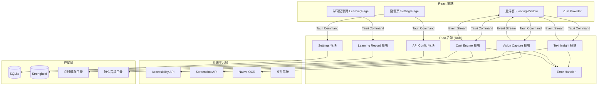

# Veya MVP 设计文档

## 概述

Veya 是一个基于 Tauri 2 的 AI 驱动语言学习桌面工具。系统采用 Rust 后端 + React 前端架构，通过系统级集成（Accessibility API、全局快捷键、截图）实现划词解析、截图识别、播客生成三大核心能力，并以悬浮窗作为主交互界面。

核心设计原则：
- **本地优先**：所有用户数据存储在本地，API Key 使用 Stronghold 加密
- **流式响应**：AI 分析结果通过 Tauri Event 流式推送至前端
- **离线可用**：配置本地模型后可完全离线工作
- **模块解耦**：各功能模块通过 Tauri Command 和 Event 通信，前后端职责清晰

## 架构

### 整体架构



### 前后端通信模型

- **Tauri Command**：前端通过 `invoke()` 调用 Rust 后端命令，用于请求-响应式交互
- **Tauri Event**：后端通过 `emit()` 向前端推送流式数据，用于 AI 分析结果的逐步输出
- **Event 命名规范**：`veya://{module}/{action}`，如 `veya://text-insight/stream-chunk`

### 窗口架构

Veya 使用 Tauri 多窗口管理：
- **主窗口（隐藏）**：托盘应用，不显示在 Dock/任务栏
- **悬浮窗**：`WebviewWindow`，设置 `always_on_top`、`decorations: false`、`transparent: true`
- **设置窗口**：独立窗口，从托盘菜单或悬浮窗打开


## 组件与接口

### 1. Text Insight 模块（划词解析）

**职责**：监听系统划词事件，获取选中文本，调用 AI 模型进行结构化分析，流式输出结果。

**Rust 后端接口**：

```rust
// Tauri Command：手动触发分析（备用）
#[tauri::command]
async fn analyze_text(text: String, app: AppHandle) -> Result<(), VeyaError>;

// 内部：Accessibility API 监听器
struct TextInsightListener {
    app_handle: AppHandle,
}

impl TextInsightListener {
    fn start_listening(&self) -> Result<(), VeyaError>;
    fn stop_listening(&self);
    fn on_text_selected(&self, text: String);
}
```

**流式输出 Event 结构**：

```typescript
// veya://text-insight/stream-chunk
interface TextInsightChunk {
  type: 'start' | 'delta' | 'done' | 'error';
  section?: 'original' | 'word_by_word' | 'structure' | 'translation' | 'colloquial' | 'simplified';
  content?: string;
  language?: string; // 检测到的语言代码
}
```

**设计决策**：
- macOS 使用 `accessibility-sys` crate 监听 `AXSelectedTextChanged` 通知
- Windows 使用 `windows-rs` 的 UI Automation API
- 语言检测使用 `whatlang` crate，轻量且无需网络
- AI 请求通过统一的 `LlmClient` 发送，支持流式 SSE 解析

### 2. Vision Capture 模块（截图识别）

**职责**：全局快捷键触发截图，框选区域，调用 Native OCR 识别，可选 AI 补全，流式输出结构化结果。

**Rust 后端接口**：

```rust
#[tauri::command]
async fn start_capture(app: AppHandle) -> Result<(), VeyaError>;

#[tauri::command]
async fn process_capture(
    image_data: Vec<u8>,
    region: CaptureRegion,
    ai_completion: bool,
    app: AppHandle,
) -> Result<(), VeyaError>;

struct CaptureRegion {
    x: f64,
    y: f64,
    width: f64,
    height: f64,
}
```

**流式输出 Event 结构**：

```typescript
// veya://vision-capture/stream-chunk
interface VisionCaptureChunk {
  type: 'ocr_result' | 'ai_completion' | 'analysis_delta' | 'done' | 'error';
  content?: string;
  is_ai_inferred?: boolean; // 标记 AI 推测内容
}
```

**设计决策**：
- macOS 截图使用 `CGWindowListCreateImage` API
- Windows 截图使用 `Graphics.Capture` API
- macOS OCR 使用 Vision Framework（`VNRecognizeTextRequest`）
- Windows OCR 使用 `Windows.Media.Ocr` API
- 框选交互在前端实现：创建全屏透明窗口，用户拖拽选区后将坐标传回 Rust

### 3. Cast Engine 模块（播客生成）

**职责**：接收文本内容，生成口语讲解稿，调用 TTS 服务生成音频，管理音频缓存。

**Rust 后端接口**：

```rust
#[tauri::command]
async fn generate_podcast(
    input: PodcastInput,
    options: PodcastOptions,
    app: AppHandle,
) -> Result<String, VeyaError>; // 返回音频文件路径

#[tauri::command]
async fn save_podcast(temp_path: String) -> Result<String, VeyaError>; // 返回持久化路径

#[tauri::command]
async fn cleanup_temp_audio() -> Result<(), VeyaError>;

struct PodcastInput {
    content: String,
    source: PodcastSource, // TextInsight | VisionCapture | Custom
}

struct PodcastOptions {
    speed: SpeedMode,      // Slow | Normal
    mode: PodcastMode,     // Bilingual | Immersive
    target_language: String,
}

enum SpeedMode { Slow, Normal }
enum PodcastMode { Bilingual, Immersive }
```

**流式输出 Event 结构**：

```typescript
// veya://cast-engine/progress
interface CastEngineProgress {
  type: 'script_generating' | 'script_done' | 'tts_progress' | 'done' | 'error';
  progress?: number; // 0-100
  script_preview?: string;
  audio_path?: string;
}
```

**设计决策**：
- 讲解稿生成通过 LLM 完成，使用专门的 system prompt 引导口语化输出
- TTS 调用通过统一的 `TtsClient` 抽象，按语言路由到不同服务
- 临时音频存储在 `app_cache_dir()/audio/temp/`
- 持久音频存储在 `app_data_dir()/audio/saved/`
- 应用退出时通过 Tauri `on_exit` hook 清理临时目录

### 4. Floating Window 模块（悬浮窗）

**职责**：作为主交互界面，展示分析结果，提供播客生成和音频播放控件。

**Rust 后端接口**：

```rust
#[tauri::command]
async fn show_floating_window(app: AppHandle, position: Option<WindowPosition>) -> Result<(), VeyaError>;

#[tauri::command]
async fn hide_floating_window(app: AppHandle) -> Result<(), VeyaError>;

#[tauri::command]
async fn toggle_pin(app: AppHandle) -> Result<bool, VeyaError>; // 返回新的 pin 状态

struct WindowPosition {
    x: f64,
    y: f64,
}
```

**前端组件结构**：

```typescript
// React 组件层级
FloatingWindow
├── StreamContent        // 流式内容展示区
│   ├── OriginalText     // 原文
│   ├── WordByWord       // 逐词解释
│   ├── StructureAnalysis // 句子结构
│   ├── Translation      // 翻译
│   ├── ColloquialVersion // 口语版本
│   └── SimplifiedVersion // 简化版本
├── ActionBar            // 操作栏
│   ├── PodcastButton    // 播客生成按钮
│   ├── PinButton        // Pin 按钮
│   └── CopyButton       // 复制按钮
└── AudioPlayer          // 音频播放器
    ├── PlayPauseButton
    ├── ProgressBar
    └── SaveButton
```

**设计决策**：
- 悬浮窗使用 Tauri `WebviewWindow` 创建，设置 `always_on_top: true`
- Pin 状态通过 Rust 端管理，控制窗口的 `focus_lost` 行为
- 未 Pin 时监听 `blur` 事件自动隐藏
- 窗口位置跟随鼠标光标（划词场景）或屏幕中心（截图场景）

### 5. API Config 模块

**职责**：管理 AI 模型 API 配置，加密存储 API Key。

**Rust 后端接口**：

```rust
#[tauri::command]
async fn get_api_configs() -> Result<Vec<ApiConfig>, VeyaError>;

#[tauri::command]
async fn save_api_config(config: ApiConfig) -> Result<(), VeyaError>;

#[tauri::command]
async fn test_api_connection(config: ApiConfig) -> Result<bool, VeyaError>;

struct ApiConfig {
    id: String,
    name: String,
    provider: ApiProvider,    // OpenAI | Anthropic | ElevenLabs | Ollama | Custom
    model_type: ModelType,    // Text | Vision | Tts
    base_url: String,
    model_name: String,
    api_key_ref: String,      // Stronghold 中的引用 key
    language: Option<String>, // TTS 模型的语言绑定
    is_local: bool,
}

enum ApiProvider { OpenAI, Anthropic, ElevenLabs, Ollama, Custom }
enum ModelType { Text, Vision, Tts }
```

**设计决策**：
- API Key 存储在 Stronghold vault 中，`ApiConfig` 仅保存引用 key
- 配置元数据（provider、base_url 等）存储在 SQLite
- `LlmClient` 统一封装 OpenAI 兼容接口，支持 SSE 流式解析
- Ollama 通过 OpenAI 兼容接口接入，`base_url` 指向本地地址

### 6. Learning Record 模块

**职责**：记录查询历史和播客历史，统计常用词。

**Rust 后端接口**：

```rust
#[tauri::command]
async fn get_query_history(page: u32, page_size: u32) -> Result<Vec<QueryRecord>, VeyaError>;

#[tauri::command]
async fn get_podcast_history(page: u32, page_size: u32) -> Result<Vec<PodcastRecord>, VeyaError>;

#[tauri::command]
async fn get_frequent_words(limit: u32) -> Result<Vec<FrequentWord>, VeyaError>;

#[tauri::command]
async fn save_query_record(record: QueryRecord) -> Result<(), VeyaError>;

#[tauri::command]
async fn save_podcast_record(record: PodcastRecord) -> Result<(), VeyaError>;
```

### 7. Settings 模块

**Rust 后端接口**：

```rust
#[tauri::command]
async fn get_settings() -> Result<AppSettings, VeyaError>;

#[tauri::command]
async fn update_settings(settings: AppSettings) -> Result<(), VeyaError>;

struct AppSettings {
    ai_completion_enabled: bool,
    cache_max_size_mb: u64,
    cache_auto_clean_days: u32,
    retry_count: u32,
    shortcut_capture: String,   // 如 "CommandOrControl+Shift+S"
    locale: String,             // "zh-CN" | "en-US"
}
```

### 8. 统一 AI 客户端（LlmClient）

所有 AI 调用通过统一的 `LlmClient` 抽象：

```rust
struct LlmClient {
    config: ApiConfig,
    http_client: reqwest::Client,
}

impl LlmClient {
    async fn stream_chat(&self, messages: Vec<Message>, app: &AppHandle, event_name: &str) -> Result<(), VeyaError>;
    async fn chat(&self, messages: Vec<Message>) -> Result<String, VeyaError>;
}

struct TtsClient {
    config: ApiConfig,
    http_client: reqwest::Client,
}

impl TtsClient {
    async fn synthesize(&self, text: &str, options: TtsOptions) -> Result<Vec<u8>, VeyaError>;
}
```

### 9. Error Handler

```rust
#[derive(Debug, thiserror::Error, Serialize)]
enum VeyaError {
    #[error("API Key 无效: {0}")]
    InvalidApiKey(String),
    #[error("余额不足: {0}")]
    InsufficientBalance(String),
    #[error("网络超时: {0}")]
    NetworkTimeout(String),
    #[error("模型不可用: {0}")]
    ModelUnavailable(String),
    #[error("OCR 识别失败: {0}")]
    OcrFailed(String),
    #[error("TTS 生成失败: {0}")]
    TtsFailed(String),
    #[error("存储错误: {0}")]
    StorageError(String),
    #[error("系统权限不足: {0}")]
    PermissionDenied(String),
}

struct RetryPolicy {
    max_retries: u32,
    base_delay_ms: u64,
    max_delay_ms: u64,
}

impl RetryPolicy {
    async fn execute<F, T>(&self, operation: F) -> Result<T, VeyaError>
    where F: Fn() -> Future<Output = Result<T, VeyaError>>;
}
```


## 数据模型

### SQLite 数据库 Schema

```sql
-- 查询历史
CREATE TABLE query_records (
    id TEXT PRIMARY KEY,
    input_text TEXT NOT NULL,
    source TEXT NOT NULL CHECK(source IN ('text_insight', 'vision_capture')),
    detected_language TEXT,
    analysis_result TEXT NOT NULL, -- JSON: 结构化分析结果
    created_at TEXT NOT NULL DEFAULT (datetime('now'))
);

-- 播客历史
CREATE TABLE podcast_records (
    id TEXT PRIMARY KEY,
    input_content TEXT NOT NULL,
    source TEXT NOT NULL CHECK(source IN ('text_insight', 'vision_capture', 'custom')),
    speed_mode TEXT NOT NULL CHECK(speed_mode IN ('slow', 'normal')),
    podcast_mode TEXT NOT NULL CHECK(podcast_mode IN ('bilingual', 'immersive')),
    audio_file_path TEXT NOT NULL,
    duration_seconds INTEGER,
    created_at TEXT NOT NULL DEFAULT (datetime('now'))
);

-- 常用词统计
CREATE TABLE word_frequency (
    word TEXT PRIMARY KEY,
    language TEXT NOT NULL,
    count INTEGER NOT NULL DEFAULT 1,
    last_queried_at TEXT NOT NULL DEFAULT (datetime('now'))
);

-- API 配置（非敏感部分）
CREATE TABLE api_configs (
    id TEXT PRIMARY KEY,
    name TEXT NOT NULL,
    provider TEXT NOT NULL,
    model_type TEXT NOT NULL CHECK(model_type IN ('text', 'vision', 'tts')),
    base_url TEXT NOT NULL,
    model_name TEXT NOT NULL,
    api_key_ref TEXT NOT NULL, -- Stronghold 引用
    language TEXT,             -- TTS 语言绑定
    is_local INTEGER NOT NULL DEFAULT 0,
    is_active INTEGER NOT NULL DEFAULT 0,
    created_at TEXT NOT NULL DEFAULT (datetime('now'))
);

-- 用户设置
CREATE TABLE settings (
    key TEXT PRIMARY KEY,
    value TEXT NOT NULL,
    updated_at TEXT NOT NULL DEFAULT (datetime('now'))
);
```

### Stronghold 存储结构

```
vault: "veya-keys"
├── api_key_{config_id} -> 加密的 API Key 字符串
```

### 前端状态模型

```typescript
// 全局状态（React Context 或 Zustand）
interface AppState {
  // 悬浮窗状态
  floatingWindow: {
    visible: boolean;
    pinned: boolean;
    position: { x: number; y: number };
    currentContent: StreamContent | null;
    audioState: AudioPlayerState | null;
  };
  // 设置
  settings: AppSettings;
  // 当前语言
  locale: 'zh-CN' | 'en-US';
}

interface StreamContent {
  source: 'text_insight' | 'vision_capture';
  sections: {
    original?: string;
    wordByWord?: string;
    structure?: string;
    translation?: string;
    colloquial?: string;
    simplified?: string;
  };
  aiInferredRanges?: Array<{ start: number; end: number }>; // AI 推测内容标记
  isStreaming: boolean;
}

interface AudioPlayerState {
  audioPath: string;
  isPlaying: boolean;
  progress: number;
  duration: number;
  isSaved: boolean;
}

interface AppSettings {
  aiCompletionEnabled: boolean;
  cacheMaxSizeMb: number;
  cacheAutoCleanDays: number;
  retryCount: number;
  shortcutCapture: string;
  locale: string;
}
```

### i18n 资源结构

```
src/
  locales/
    zh-CN.json
    en-US.json
```

使用 `react-i18next` 实现国际化：
- 翻译文件为 JSON 格式，按模块组织 key
- 语言切换通过 `i18n.changeLanguage()` 即时生效，无需重启
- 新增语言只需添加对应的 JSON 文件并注册


## 正确性属性

*正确性属性是系统在所有有效执行中都应保持为真的特征或行为——本质上是关于系统应该做什么的形式化陈述。属性是人类可读规范与机器可验证正确性保证之间的桥梁。*

### Property 1: 语言检测准确性

*For any* 非空文本输入，语言检测函数应返回一个有效的语言代码，且对于已知语言的文本，检测结果应与实际语言一致。

**Validates: Requirements 1.1**

### Property 2: 结构化输出完整性

*For any* 文本分析结果，输出必须包含全部六个必需字段：原文（original）、逐词解释（word_by_word）、句子结构分析（structure）、精准翻译（translation）、口语版本（colloquial）、简化版本（simplified），且每个字段均为非空字符串。

**Validates: Requirements 1.3**

### Property 3: AI 补全流水线条件行为

*For any* OCR 识别结果，处理流水线包含 AI 补全步骤当且仅当 AI_Completion 设置为启用状态。当禁用时，输出应直接来自 OCR 结果而不经过 AI 修改。

**Validates: Requirements 2.3, 2.4**

### Property 4: AI 推测内容标记

*For any* 包含 AI 补全内容的识别结果，输出数据结构中的 `aiInferredRanges` 应准确标记所有 AI 推测内容的范围，且标记范围不应与原始 OCR 内容重叠。

**Validates: Requirements 2.5**

### Property 5: 播客生成输入接受与流水线

*For any* 有效输入（来自 text_insight、vision_capture 或 custom 三种来源之一），Cast Engine 应接受该输入并按顺序产生所有流水线阶段的输出（script_generating → script_done → tts_progress → done）。

**Validates: Requirements 3.1, 3.2**

### Property 6: 播客输出选项与格式

*For any* 速度模式（slow/normal）和播客模式（bilingual/immersive）的组合，Cast Engine 应生成有效的 MP3 格式音频文件，且文件大小大于零。

**Validates: Requirements 3.3, 3.4**

### Property 7: 音频存储生命周期

*For any* 生成的播客音频，默认应存储在临时缓存目录中。执行保存操作后，音频文件应存在于持久化目录中。执行清理操作后，所有临时缓存目录中的音频文件应被删除，而持久化目录中的文件不受影响。

**Validates: Requirements 3.5, 3.6**

### Property 8: TTS 语言路由

*For any* 语言代码和对应的 TTS 服务配置，TTS 客户端应将请求路由到该语言配置的服务地址，而非其他语言的服务地址。

**Validates: Requirements 3.7**

### Property 9: 悬浮窗 Pin/隐藏状态机

*For any* 悬浮窗状态，当窗口失去焦点时：若 pinned 为 false 则窗口应自动隐藏；若 pinned 为 true 则窗口应保持可见。切换 Pin 状态应翻转 pinned 值。

**Validates: Requirements 4.2, 4.3**

### Property 10: API 配置独立性与持久化

*For any* API 配置集合，不同 model_type（text、vision、tts）的配置应独立存储和检索。保存配置后重新读取应返回相同的 provider、base_url、model_name 等字段值。

**Validates: Requirements 5.1, 5.2**

### Property 11: API Key 加密存储往返

*For any* API Key，通过 API Config 系统存储后，SQLite 中的 api_configs 表应仅包含 Stronghold 引用而非明文 Key。通过引用从 Stronghold 读取应返回原始 Key 值。

**Validates: Requirements 5.5**

### Property 12: 学习记录自动持久化

*For any* 完成的查询操作（划词或截图）或播客保存操作，数据库中应存在对应的记录，且记录包含所有必需字段（输入内容、分析结果/音频路径、时间戳）。

**Validates: Requirements 6.1, 6.2**

### Property 13: 词频统计准确性

*For any* 查询序列，常用词列表中每个词的频次应等于该词在所有查询输入中出现的总次数。

**Validates: Requirements 6.3**

### Property 14: 缓存清理策略

*For any* 缓存清理配置（最大空间 M、最大天数 D），执行清理后：持久化音频目录的总大小不应超过 M MB，且不应存在创建时间超过 D 天的音频文件。

**Validates: Requirements 7.3**

### Property 15: 设置往返一致性

*For any* 有效的设置值集合（包括快捷键字符串、语言代码），保存设置后重新读取应返回完全相同的值。语言切换应立即反映在读取的设置中。

**Validates: Requirements 7.5, 7.6, 9.2**

### Property 16: 重试策略执行

*For any* 配置的重试次数 N 和持续失败的 API 调用，系统应恰好执行 N 次重试后停止，总调用次数为 N+1（1 次初始 + N 次重试）。

**Validates: Requirements 8.1**

### Property 17: 错误类型分类

*For any* API 错误（Key 无效、余额不足、网络超时、模型不可用），在所有重试失败后，返回的错误信息应包含对应的具体错误类型标识，使前端能够展示有意义的错误消息。

**Validates: Requirements 8.2**


## 错误处理

### 错误分类与处理策略

| 错误类型 | 错误码 | 是否重试 | 用户提示 |
|---------|--------|---------|---------|
| API Key 无效 | `InvalidApiKey` | 否 | "API Key 无效，请检查配置" |
| 余额不足 | `InsufficientBalance` | 否 | "API 余额不足，请充值" |
| 网络超时 | `NetworkTimeout` | 是 | "网络连接超时，正在重试..." |
| 模型不可用 | `ModelUnavailable` | 是 | "模型暂时不可用，正在重试..." |
| OCR 识别失败 | `OcrFailed` | 否 | "文字识别失败，请重新截图" |
| TTS 生成失败 | `TtsFailed` | 是 | "音频生成失败，正在重试..." |
| 存储错误 | `StorageError` | 否 | "数据存储失败，请检查磁盘空间" |
| 权限不足 | `PermissionDenied` | 否 | "系统权限不足，请在系统设置中授权" |

### 重试机制

```rust
// 指数退避重试
impl RetryPolicy {
    async fn execute<F, Fut, T>(&self, operation: F) -> Result<T, VeyaError>
    where
        F: Fn() -> Fut,
        Fut: Future<Output = Result<T, VeyaError>>,
    {
        let mut last_error = None;
        for attempt in 0..=self.max_retries {
            match operation().await {
                Ok(result) => return Ok(result),
                Err(e) if e.is_retryable() && attempt < self.max_retries => {
                    let delay = std::cmp::min(
                        self.base_delay_ms * 2u64.pow(attempt),
                        self.max_delay_ms,
                    );
                    tokio::time::sleep(Duration::from_millis(delay)).await;
                    last_error = Some(e);
                }
                Err(e) => return Err(e),
            }
        }
        Err(last_error.unwrap())
    }
}
```

### 流式错误处理

AI 流式输出过程中发生错误时：
- 通过 Event 发送 `type: 'error'` 消息，包含错误类型和用户可读消息
- 前端收到错误 Event 后停止流式渲染，展示错误提示
- 已接收的部分内容保留展示，不清空

### Accessibility API 权限处理

- macOS：首次启动时检测 Accessibility 权限，未授权时引导用户到系统偏好设置
- Windows：UI Automation 通常无需额外权限，但在受限环境中捕获异常并提示

## 测试策略

### 双重测试方法

Veya 采用单元测试与属性测试相结合的策略：

- **单元测试**：验证具体示例、边界情况和错误条件
- **属性测试**：验证跨所有输入的通用属性

两者互补：单元测试捕获具体 bug，属性测试验证通用正确性。

### 属性测试配置

- **测试库**：Rust 端使用 `proptest` crate，React 前端使用 `fast-check`
- **每个属性测试最少运行 100 次迭代**
- **每个属性测试必须以注释引用设计文档中的属性编号**
- **标签格式**：`Feature: veya-mvp, Property {number}: {property_text}`
- **每个正确性属性由单个属性测试实现**

### Rust 后端测试

```rust
// 示例：Property 16 - 重试策略执行
// Feature: veya-mvp, Property 16: 重试策略执行
proptest! {
    #[test]
    fn retry_policy_executes_correct_count(retry_count in 1u32..10) {
        // 生成随机重试次数，验证总调用次数 = retry_count + 1
    }
}
```

**单元测试重点**：
- 各 API Provider 的请求格式构造（OpenAI、Anthropic、ElevenLabs、Ollama）
- SQLite CRUD 操作的边界情况
- Stronghold 加密/解密的具体示例
- 错误类型分类的具体场景

**属性测试重点**：
- Property 1-17 的全部正确性属性
- 重点覆盖：设置往返（Property 15）、重试策略（Property 16）、错误分类（Property 17）、词频统计（Property 13）

### React 前端测试

```typescript
// 示例：Property 9 - 悬浮窗 Pin/隐藏状态机
// Feature: veya-mvp, Property 9: 悬浮窗 Pin/隐藏状态机
fc.assert(
  fc.property(fc.boolean(), (pinned) => {
    // 生成随机 pin 状态，验证 blur 事件后的可见性
  }),
  { numRuns: 100 }
);
```

**单元测试重点**：
- 流式内容渲染的具体示例
- i18n 翻译 key 完整性检查
- 音频播放器控件状态

**属性测试重点**：
- Property 2（结构化输出完整性）
- Property 4（AI 推测内容标记）
- Property 9（Pin/隐藏状态机）
- Property 15（设置往返，前端部分）

### 集成测试

- Text Insight 端到端流程：模拟文本输入 → 验证 Event 流输出
- Vision Capture 流水线：模拟 OCR 结果 → 验证 AI 补全条件分支
- Cast Engine 流水线：模拟输入 → 验证音频文件生成与存储
- 学习记录：执行操作 → 验证数据库记录完整性

